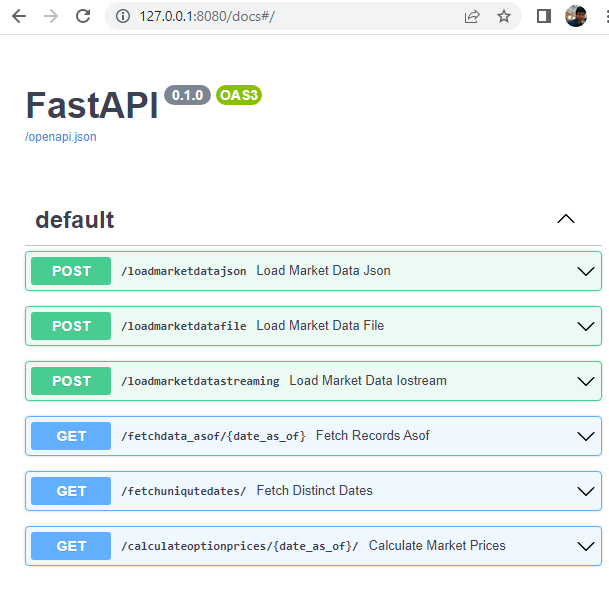
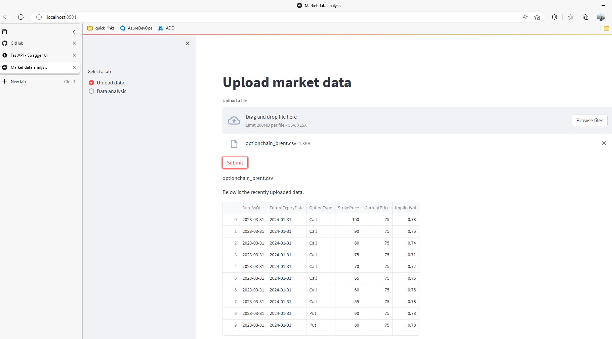
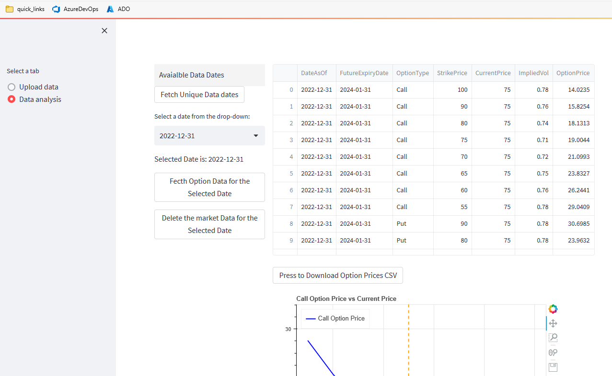
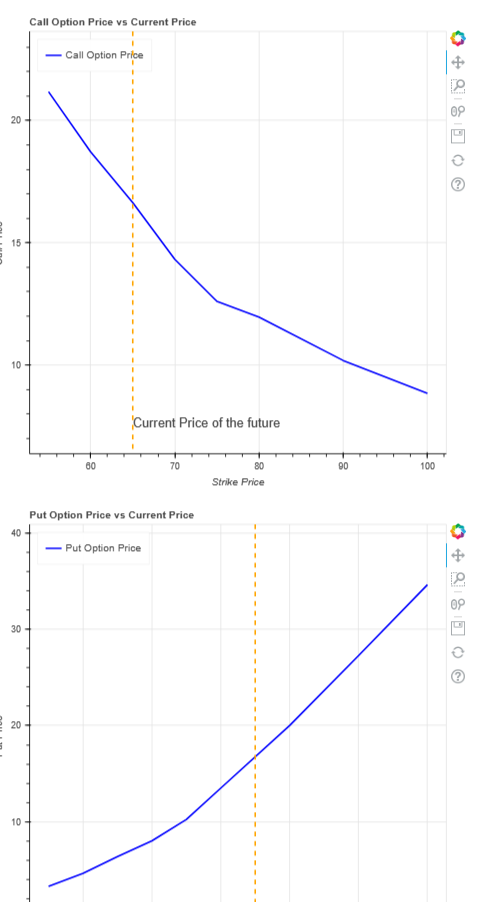

# fastapi_streamlit_test
This application developed using FastAPI, Streamlit web packages. 
The work flow begins by reading by option pricing data in either CSV or Excel format, then it stores the data in a sqlite db.
User can also provide the market data in a JSON formatted text or call the api endpoint with with a json text.
This application renders the web pages using streamlit package to provide interface for various CRUD operations.
When user select the option to calculate option prices, it calculates the option prices using Black76 model and shows the ressults in tabular format as well as in a  interactive line plot(by using Python Bokeh package). It also provides the option to download the option prices in a CSV file. 


### Build Setup in Windows
(needed only one time to setup the environment)

```
python -m venv .venv
.\.venv\Scripts\activate.ps1
python -m pip install -r ./requirements.txt
```
### Running the application

```
Activate Virtual Environment:
.\.venv\Scripts\activate.ps1 

Run API server
python .\src\api_manager.py

Run Web server
streamlit run .\src\gui_manager.py

Run the test cases
pytest .\src\tests\test_b76_option_model.py
pytest .\src\tests\test_option_pricer_api.py
```


### Screen shots of the application









